<div align="center">

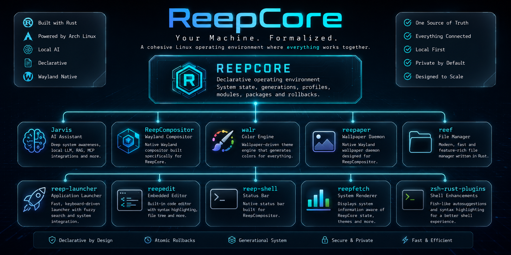

</div>


---
<div align="center">
  
# A Different Kind of Linux Environment

Most Linux desktops slowly become collections of unrelated tools.

Different configuration files.

Different update cycles.

Different caches.

Different philosophies.

Eventually...

Nobody remembers how it all fits together.

ReepCore takes a different approach.

Instead of assembling dozens of independent projects, it builds an entire operating environment where every component understands every other component.

Not another Hyprland setup.

Not another dotfiles repository.

Not another package manager.

Not another AI chatbot.

> **The operating system becomes self-aware.**

Every component understands the state of the system.

Every tool speaks the same language.

AI becomes part of the operating environment instead of another application.

---

# Everything. Together.

<div align="center">

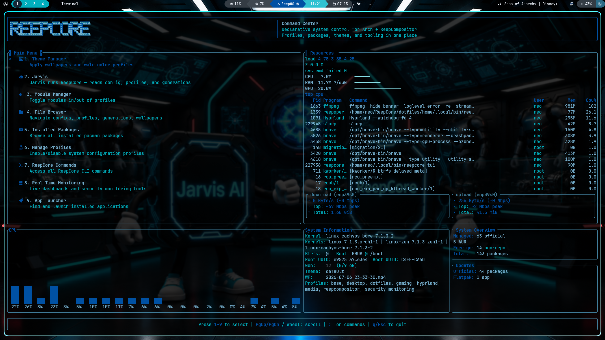

</div>


ReepCore transforms a traditional Arch Linux installation into a cohesive operating environment where system management, desktop configuration, development, and AI all operate from one source of truth.

---


---
<div align="center">


# Built Around One Source of Truth

```text
                  REEPCORE
                      │
      ┌───────────────┼────────────────┐
      │               │                │
    State          Outputs         Control
      │               │                │
 Profiles       Generated Files      CLI
 Themes          Colors              TUI
 Generations     Cache              Jarvis
 Modules         Runtime            Automation
```
<div align="center">
  
Everything belongs somewhere.

Everything has one owner.

Everything works together.

---

# Modular by Design

Enable complete capabilities instead of hunting through dozens of configuration files.

Profiles describe **what** your system should become.

Modules describe **how** it gets there.

<div align="center">

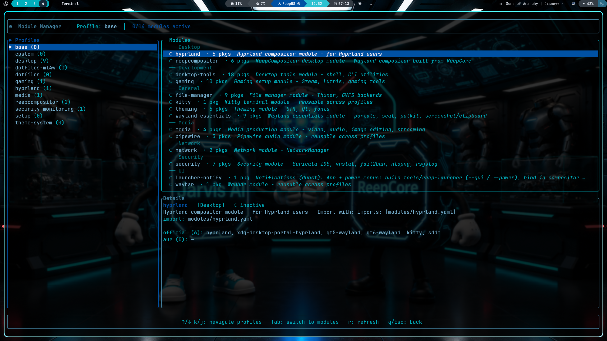

</div>

Desktop.

Development.

Gaming.

Security.

Networking.

Media.

Everything is declarative.

---

# Meet Jarvis

<div align="center">

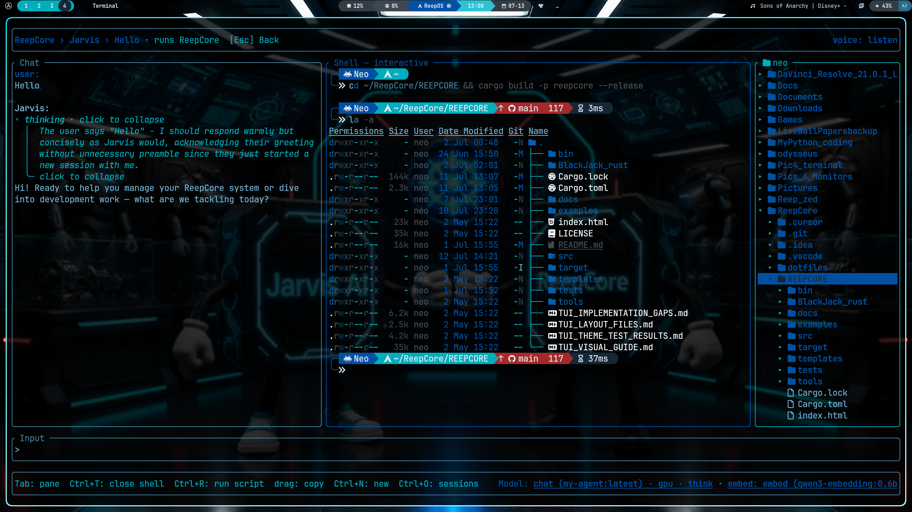

</div>

Jarvis isn't another chat window.

It lives inside your operating system.

It understands:

Running system
Installed packages
Active profiles
Theme state
Open files
Embedded editor
Embedded terminal
Git worktrees
Local RAG
JetBrains MCP
Network monitoring
Security monitoring

Everything runs locally through Ollama.

No cloud required.

---

<div align="center">

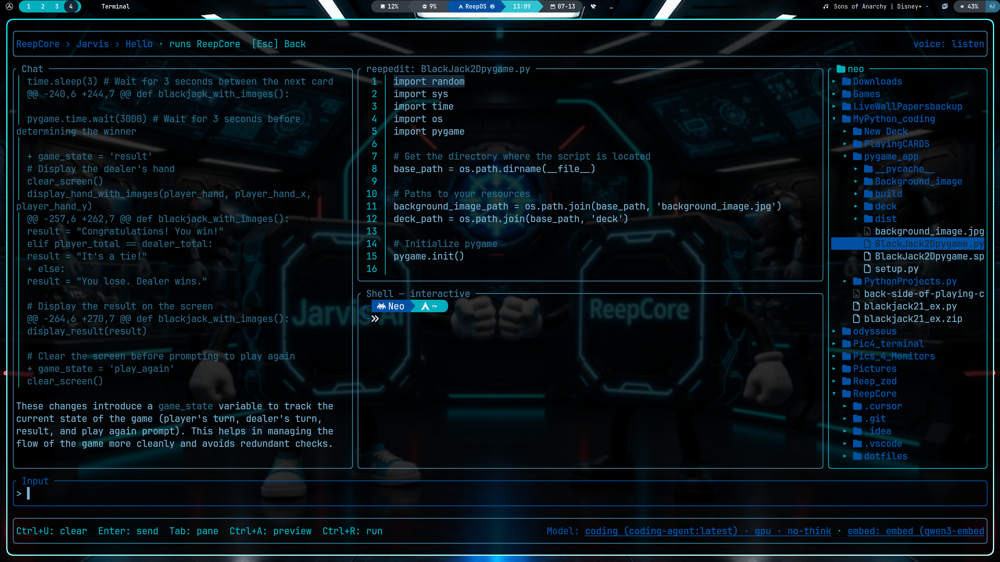

</div>

Development happens without leaving ReepCore.

Included workflows:

Embedded editor
Interactive terminal
AI code review
Unified diff preview
Patch application
Cargo integration
Git sandbox worktrees
RustRover MCP
Local RAG
Multi-model routing

Your operating system understands your projects.

---

# Theme Everything

<div align="center">

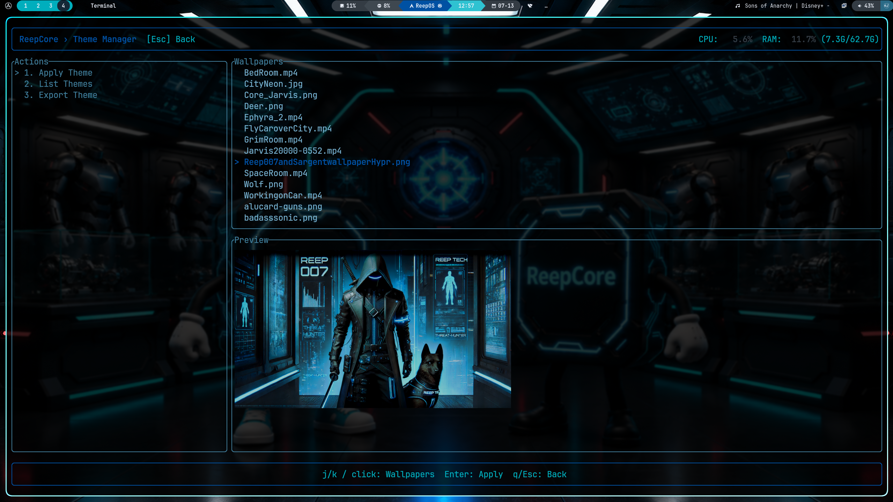

<br><br>

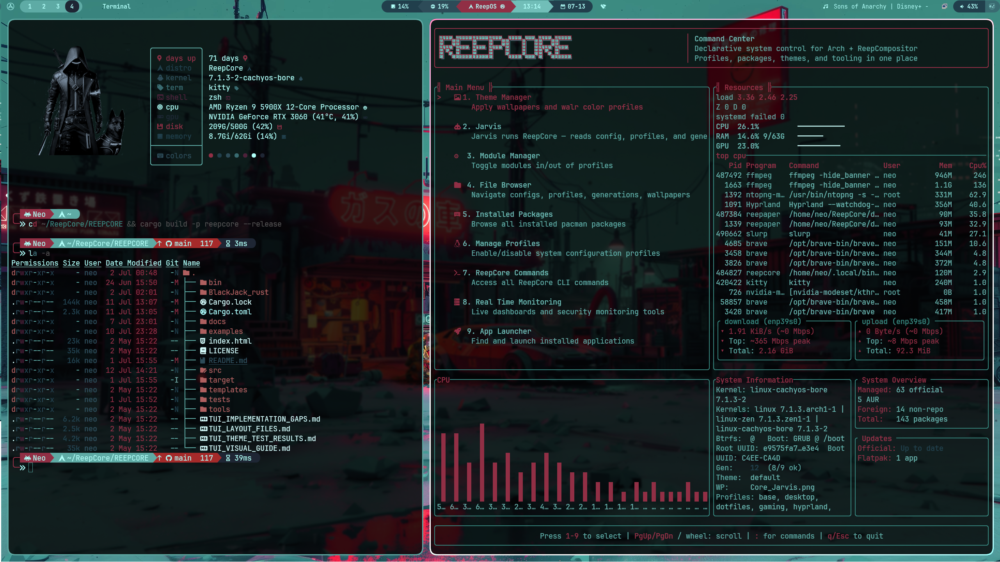
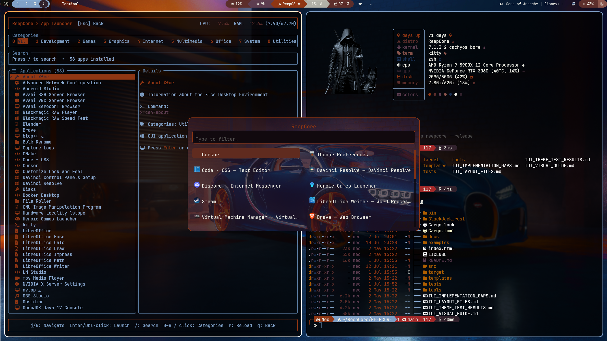

<br><br>

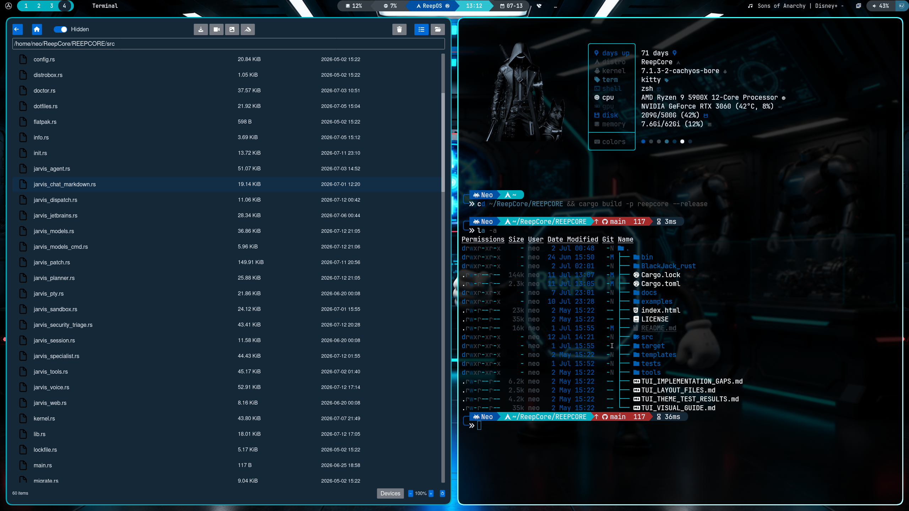
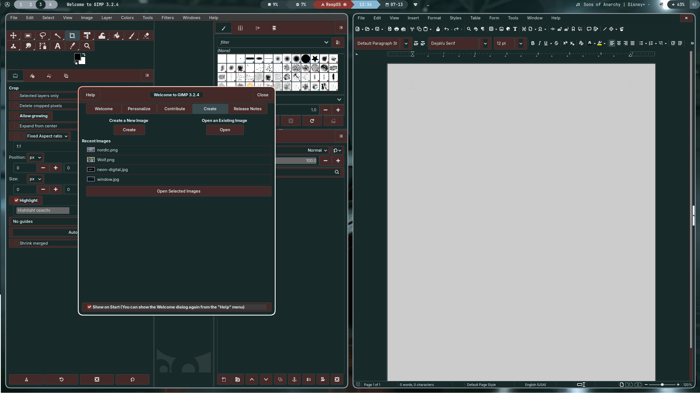

<br><br>

</div>

One wallpaper.

One command.

Everything updates.

walr automatically generates:

Terminal colors
GTK themes
Wayland themes
Application themes
Shell colors

Everything remains synchronized.

---

# Built Around Your System

ReepCore doesn't stop at configuring your desktop.

It understands the operating system itself.

<div align="center">

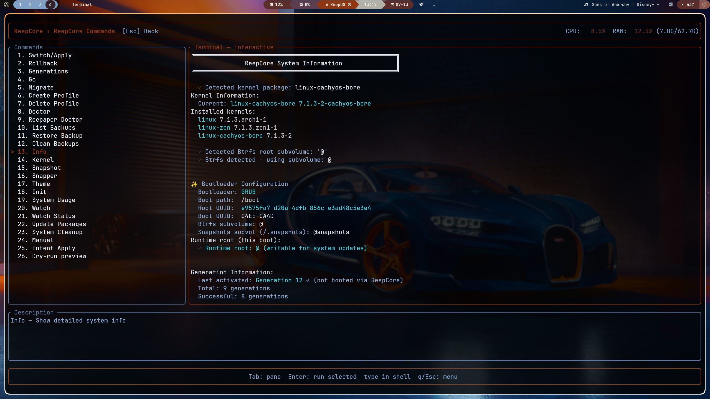

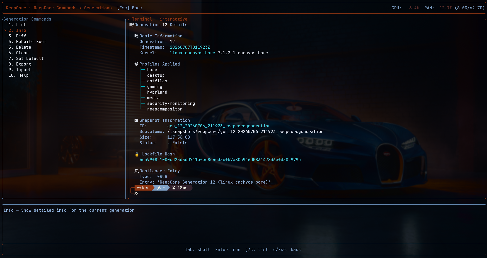

</div>

Track:

Installed kernels
Bootloader configuration
Btrfs snapshots
Generations
Runtime state
System information

All from one interface.

---

# Know Your System

Before making changes, ReepCore verifies your environment.

<div align="center">

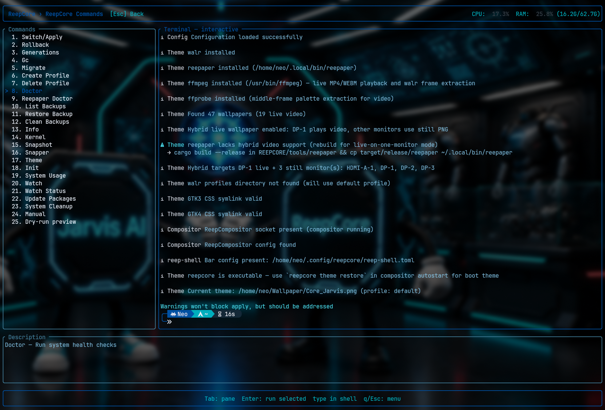

</div> 

Health checks include:

Theme validation
ReepCompositor
GTK integration
Runtime verification
Configuration checks
Dependency validation

Know what's wrong before it becomes a problem.

---

# Monitor Everything

<div align="center">

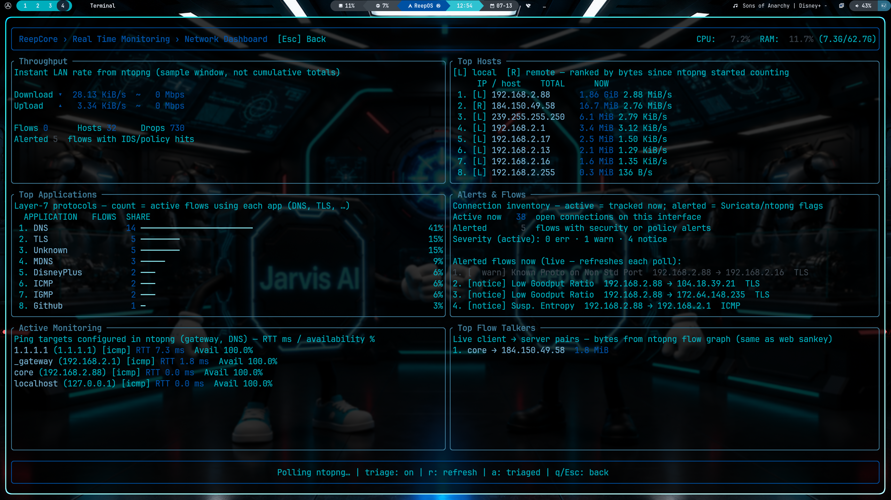

</div>

Your desktop is also your operations center.

Monitor:

CPU
Memory
Network
Services
ntopng
Fail2Ban
Suricata
Security Events

Without leaving ReepCore.

---

# Local First

✔ Local AI

✔ Local Models

✔ Local Embeddings

✔ Local Voice

✔ Local RAG

✔ Local Git

✔ Local Search

✔ Local Editing

✔ Local Terminal

No subscriptions.

No cloud.

No telemetry.


---

# Philosophy

ReepCore is intentionally opinionated.

It doesn't try to support every workflow.

It doesn't try to become another Linux distribution.

Instead...

It formalizes one complete Linux environment into a cohesive platform where every component understands every other component.

The result isn't a collection of tools.

It's an operating environment.

---

# Roadmap

| Status | Feature |
|:------:|---------|
| ✅ | Declarative System Management |
| ✅ | Atomic Rollbacks |
| ✅ | Module Manager |
| ✅ | Theme Engine |
| ✅ | ReepCompositor |
| ✅ | Jarvis AI |
| ✅ | Embedded Editor |
| ✅ | Embedded Terminal |
| ✅ | Git Sandbox |
| ✅ | Local RAG |
| ✅ | Security Monitoring |
| ✅ | JetBrains MCP |
| 🚧 | Multi-Agent Workflows |
| 🚧 | Remote Node Management |
| 🚧 | Plugin System |

---

<div align="center">

# ReepCore

### Your Machine. Formalized.

**Built with Rust • Powered by Arch Linux • Enhanced by Local AI**

*"A system should be more than the sum of its parts."*

</div>
